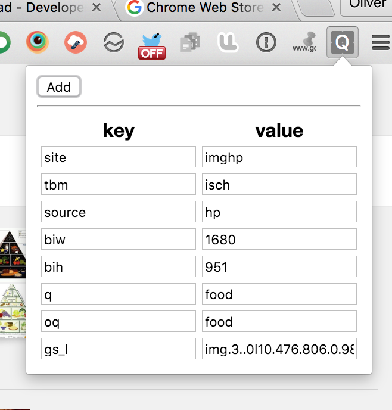

# query-params-chrome

Written using [Elm](http://elm-lang.org/).



## Testing

```
elm-make Main.elm --output elm.js
```

Add the folder as a Chrome extension.

For testing outside of the Chrome extension infrastructure, run `elm-reactor`
and go to `popup.html`. You will need to update the input to use test data.
