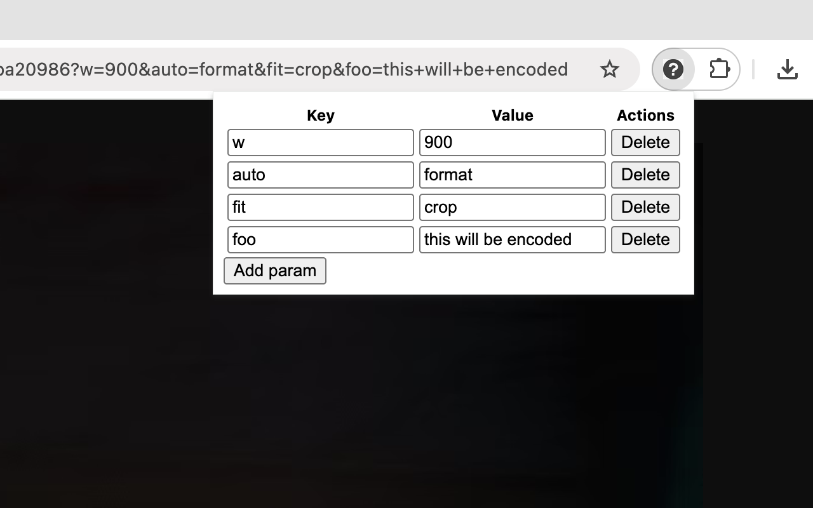

# Query params Chrome extension

Chrome extension which provides a user interface to read/write URL search/query parameters for the currently active tab.

https://chrome.google.com/webstore/detail/query-params/jgacgeahnbmkhdhldifidddbkneahmal

## Unpacked installation

1. `npm run build`
2. Load `dist` as unpacked extension
